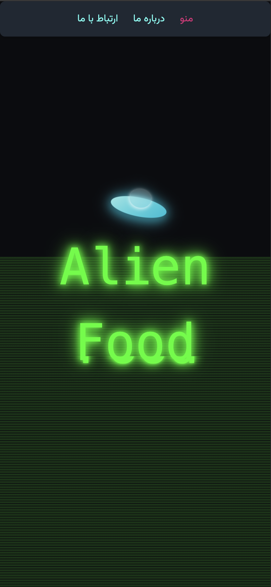

# 🛸 Alien Food - منوی آنلاین رستوران فضایی

Alien Food is an attractive and modern online food menu project built using pure HTML, CSS (Tailwind) and JavaScript. It offers a different experience for users with visual and composite effects.
---

## 📷 پیش‌نمایش

[گیت هاب پیج](https://danialkk.github.io/alien-food/)  

---

## ✨ امکانات

- 🎨 طراحی تاریک و مدرن با رنگ‌های نئونی
- 🛸 بشقاب‌پرنده متحرک در پس‌زمینه سایت
- 🟩 افکت بارش ماتریکس در پس‌زمینه
- 🧾 منوی دسته‌بندی شده با نمایش قیمت و توضیح
- 📍 نمایش موقعیت رستوران روی نقشه Google Maps
- 📱 طراحی واکنش‌گرا (مناسب موبایل و دسکتاپ)
- ⚡ اسکرول نرم و بخش‌بندی با ناوبری سریع

---

## 🔧 تکنولوژی‌ها

- HTML5
- Tailwind CSS
- JavaScript (Vanilla)
- Google Maps (iframe)

